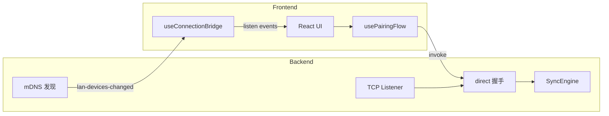
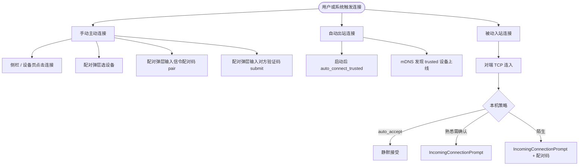
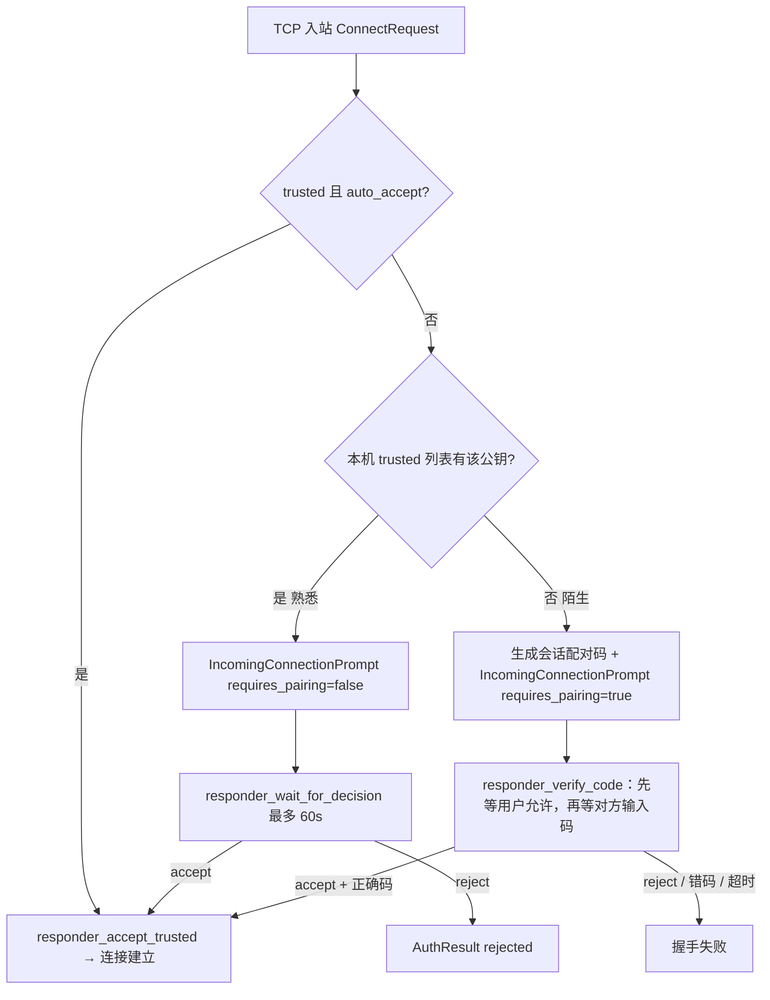

# PlanarClip 连接行为说明

> 基于当前代码实现整理（2026-06-26）。描述局域网直连下的发现、配对、连接、断开及相关 UI 行为。  
> 浏览器预览模式（`pnpm dev:web`）仅展示界面，所有连接能力需在 Tauri 桌面应用中体验。

---

## 1. 架构概览

PlanarClip 的连接能力由 **Rust 后端** 与 **React 前端** 协作完成：

| 层级 | 职责 |
|------|------|
| Rust | mDNS 设备发现、TCP 监听（默认端口 dev `19877` / release `19876`）、握手协议、配对码会话、剪贴板同步通道、自动连接、持久化已信任设备 |
| React | 设备列表展示、配对弹层、入站确认弹层、状态提示、用户操作 invoke |

**传输方式**：局域网 TCP 直连 + JSON 帧握手，连接建立后走 `SignalMessage` 数据通道（剪贴板同步等）。  
**信令配对码路径**（`pair` 命令 → WebSocket 信令服务器 `ws://localhost:8765`）仍保留在 UI 中，但主流程为局域网直连。

---

## 2. 状态模型

### 2.1 前端连接状态 `AppConnectionStatus`

| 值 | 含义 | 典型 UI |
|----|------|---------|
| `offline` | 未连接 | 侧栏「监听中」/ 设备页可发起连接 |
| `connecting` | 连接进行中 | 侧栏「连接中…」/ 配对弹层或入站确认 |
| `online` | 已建立会话 | 侧栏「已连接」/ 剪贴板可同步 |

### 2.2 配对阶段 `PairingStage`

| 阶段 | 含义 | 谁触发 |
|------|------|--------|
| `idle` | 无进行中的配对流程 | 初始 / 重置后 |
| `requesting_device` | 主动连接中，等待对端握手结果 | 点击连接局域网设备 |
| `awaiting_code` | 对端要求配对码，等待本机输入 | `connect_lan` 返回 `awaiting_code` |
| `submitting_code` | 正在提交 6 位配对码 | 用户在配对弹层点「验证」 |
| `manual_pairing` | 正在通过信令服务器 `pair` 命令配对 | 配对弹层手动输入码 + 非 `awaiting_code` 模式 |
| `incoming_request` | 收到入站连接，等待用户允许/拒绝 | `connection-request` 事件 |
| `incoming_accepting` | 用户已点允许，等待后端完成握手 | 熟悉设备入站、非配对流程 |
| `incoming_pairing` | 用户已允许陌生设备配对，展示本机配对码 | 陌生设备入站且 `requires_pairing` |
| `error` | 连接失败（非「被拒绝」类） | 各类错误回写 |

### 2.3 后端关键 pending 状态

| 状态 | 说明 |
|------|------|
| `connected` | 是否已有活跃数据通道 |
| `pending_initiator` | 主动方已收到 `AwaitCode`，等待 `submit_pairing_code` |
| `pending_connection_request` | 入站连接等待用户确认（可跨 WebView 重建恢复） |
| `pending_accept_tx` / `pending_reject_tx` | 入站握手与用户操作的桥接 |
| `pairing_session_code` | 陌生设备入站时的会话级 6 位配对码（与静态码不同） |

### 2.4 设备分类（前端 `buildDevices` + `categorizeDevices`）

| 关系 | 判定 | 设备页分区 |
|------|------|------------|
| **已配对（connected）** | 当前会话已连接 | 「已配对」 |
| **熟悉 + 在线未连** | `isTrusted` 且 mDNS 可见 | 「附近」熟悉区 |
| **陌生 + 在线未连** | 非 trusted 且 mDNS 可见 | 「附近」陌生区 |
| **熟悉 + 离线** | trusted 但当前 LAN 不可见 | 「离线」 |
| **陌生 + 离线** | 不展示 | — |

熟悉关系由配置 `trusted_peers` 持久化；成功完成任意一次局域网配对/连接后会写入该列表。

---

## 3. 连接发起方式总览

---

## 4. 主动连接（出站）

### 4.1 触发入口

| 入口 | 行为 |
|------|------|
| **侧栏设备列表** | 点击 `PlugZap` → `handleConnectLan(device)` |
| **设备页 · 附近** | 熟悉/陌生卡片上的连接按钮 |
| **设备页 · 离线** | 仅有 `last_ip` 时显示地址，无连接按钮（需等 mDNS 发现） |
| **配对弹层 · 设备列表** | 切换目标设备 → 先 `disconnect` 再连新设备 |
| **设置 · 自动连接已信任设备** | 不直接点连，见 §5 |

**前置限制**（前端）：

- 已有 `online` 连接时，不能再连其他设备（需先断开）。
- `connecting` 时侧栏/设备页连接按钮禁用。
- 设备缺少 `host`/`port` 时无法连接。

### 4.2 熟悉 vs 陌生（主动方视角）

`connect_lan` 根据 **本机** `trusted_peers` 是否包含目标 `peer_id` 决定握手参数：

| 本机是否认识目标 | `requires_confirmation` | 预期对端行为 |
|------------------|-------------------------|--------------|
| 认识（熟悉） | `false` | 对端若 `auto_accept` → 直接连通；否则弹出确认 |
| 不认识（陌生） | `true` | 对端走陌生入站流程 → 通常返回 `AwaitCode` |

### 4.3 出站阶段与 UI

#### 阶段 A：`requesting_device`

1. 打开 **PairingModal**，显示目标设备卡片。
2. `status` → `connecting`，状态栏「正在建立连接…」。
3. 调用 `connect_lan`。

**可能结果：**

| 结果 | 后续 |
|------|------|
| 返回 `"connected"` | 直接 `online`，关闭弹层，提示「已与 XX 建立连接…」 |
| 返回 `"awaiting_code"` | 进入 `awaiting_code`，提示输入对端屏幕配对码 |
| 命令抛错 | 见 §8 失败处理 |

#### 阶段 B：`awaiting_code`

1. 配对弹层显示 60 秒倒计时进度条（`usePairingCountdown`）。
2. 用户输入 6 位数字 → 点「验证」→ `submitting_code` → `submit_pairing_code`。
3. 倒计时归零 → 自动 `rotate_pairing_code`（仅当后端有活跃配对会话时有效；此阶段主动方等的是**对方屏幕上的码**，本机 rotate 主要服务于入站展示）。

**成功**：后端 emit `connection-established` → 前端 `online`，关闭弹层。  
**失败**：见 §8。

#### 阶段 C：配对弹层 · 信令 `pair`（`manual_pairing`）

- 不选设备、直接输入 6 位码并提交（`stage !== awaiting_code` 时走 `handleManualPair`）。
- 调用 `pair` 命令连接 WebSocket 信令服务器，**非当前主路径**。
- 成功则 `online`，显示「已配对设备」；失败停留 `error` 状态于弹层内。

### 4.4 关闭 / 取消主动连接

用户在 **PairingModal** 点关闭（× 或遮罩）时 `closePairingModal`：

| 当前阶段 | 行为 |
|----------|------|
| 存在 `incomingRequest` | 等同拒绝入站（见 §6） |
| `awaiting_code` / `requesting_device` / `submitting_code` | 调用 `disconnect`，提示「已取消本次连接…」，关闭弹层 |
| 其他 | 仅重置并关闭弹层 |

---

## 5. 自动连接

自动连接分 **两种独立机制**，不要混淆：

### 5.1 全局：自动连接已信任设备（出站）

**设置项**：设置页 →「自动连接已信任设备」→ 持久化 `auto_connect_trusted`。

**触发时机：**

1. **应用启动约 2 秒后**：遍历所有 trusted peers，优先用 mDNS 快照中的 IP:port，否则用 `last_ip` + 默认端口。
2. **mDNS 发现变更**：新设备上线且 `peer_id` 在 trusted 列表中。

**执行条件**（全部满足才发起）：

- `auto_connect_trusted == true`
- 当前未连接（`connected == false`）
- 无 `pending_initiator`
- 无待处理入站请求

**握手特点**：

- 始终以熟悉设备身份发起（`requires_confirmation = false`）。
- 若对端仍需配对码（`AwaitingCode`），**静默放弃**（关闭 TCP，不弹 UI，仅写日志）。
- 失败时 **默认不** emit `connection-failed`（避免骚扰）；仅 debug 日志。

**成功 UI**：与其他出站相同，收到 `connection-established`（`is_reconnect: true`）→ 提示「已恢复与 XX 的连接」。

### 5.2 单设备：自动接受连接（入站）

**设置项**：设备页 trusted 设备卡片 →「自动接受连接」→ `set_peer_auto_accept` → 持久化 `trusted_peers[].auto_accept`。

**默认值**：`true`（`peer_auto_accepts` 对 `None` 视为开启）。

**效果**：该 familiar 设备 TCP 连入时，**跳过** `IncomingConnectionPrompt`，后端直接 `responder_accept_trusted`，emit `connection-established`。

**关闭后**：仍视为熟悉设备，但会弹出确认窗口，需用户点「允许连接」。

---

## 6. 被动连接（入站）

### 6.1 后端处理分支

对端 TCP 连入 → `read_connect_request` → `handle_incoming_connection`：

### 6.2 窗口与通知

`present_connection_request` 会：

1. 写入 `pending_connection_request`（供 WebView 重建后 `get_pending_connection_request` 恢复）。
2. 若主窗口不可见 → 发送 **系统通知** + 任务栏闪烁（不抢焦点）。
3. 必要时重建 WebView 窗口。

### 6.3 入站 UI 流程

#### 第一步：`IncomingConnectionPrompt`（z-index 60）

显示条件：`incomingRequest` 存在且 `pairingStage` 为 `incoming_request` 或 `incoming_accepting`。

| 类型 | 标题 | 允许按钮 |
|------|------|----------|
| 熟悉设备 | 「收到新的连接请求」 | 「允许连接」 |
| 陌生设备 | 「陌生设备请求配对」 | 「允许配对」 |

用户操作：

| 操作 | 前端 | 后端 |
|------|------|------|
| **拒绝** | `reject_connection` → 重置 → `offline` | 向对端发 `rejected` |
| **允许** | `accept_connection` | 熟悉：直接完成握手；陌生：进入配对码等待 |

#### 第二步（仅陌生设备）：`PairingModal` · `incoming_pairing`

- 展示 **本机会话配对码**（6 位，60 秒倒计时，过期自动轮换）。
- 输入框禁用（等**对方**输入本机码）。
- 关闭按钮文案：「取消这次连接」→ 等同拒绝。

#### 熟悉设备允许后：`incoming_accepting`

- 仅 **IncomingConnectionPrompt** 显示「正在连接…」，无 PairingModal。
- 成功后 `connection-established`，弹层全部关闭。

### 6.4 入站失败

后端在以下情况 emit `connection-failed`（用户主动拒绝/取消 **不** emit）：

- 熟悉设备确认超时（60s）
- 陌生设备配对超时、协议错误等
- **不包括**：`Cancelled`（用户拒绝）、`InvalidCode`（配对码错误，对端会收到错误）

前端 `handleConnectionFailed`：

- **`kind: rejected`**：StatusNotice 弹窗 + 关闭所有配对 UI（主动方正等待时）。
- **入站相关阶段**：先 `resetPairingFlow(false)` 清 incoming，再 `error` 阶段（**PairingModal 不强制打开**，除非 `showPairing` 仍为 true）。
- 其他错误：同上，`error` 状态。

---

## 7. 配对码机制

### 7.1 两类配对码

| 类型 | 来源 | 何时使用 |
|------|------|----------|
| **静态码** | 由本机密钥指纹派生（`pairing_code_from_key_pair`） | 无活跃入站配对会话时；配对弹层默认展示 |
| **会话码** | 陌生入站时 `generate_pairing_code()` 随机生成 | 陌生设备入站且用户点「允许配对」后；存于 `pairing_session_code` |

### 7.2 有效期与轮换

| 位置 | 时长 | 轮换方式 |
|------|------|----------|
| 前端倒计时 | 60 秒 | 归零调用 `rotate_pairing_code`（需有会话） |
| 后端 `responder_verify_code` | 60 秒无输入 | 自动生成新码 + emit `pairing-code-rotated` |
| 后端 `responder_wait_for_decision` | 60 秒无确认 | 超时失败 `timeout` |

`pairing-code-rotated` 事件会更新前端 `pairingCode` 与轮换提示文案。

### 7.3 主动方输入配对码

陌生设备互连时：**主动方**在 `awaiting_code` 阶段输入 **被动方屏幕显示** 的 6 位码 → `submit_pairing_code`。

---

## 8. 成功路径汇总

| 场景 | 后端事件/返回值 | 前端结果 |
|------|-----------------|----------|
| 主动连熟悉且对端 auto_accept | `connect_lan` → `connected` 或 `connection-established` | `online`，关闭弹层 |
| 主动连熟悉需对端确认 | 对端允许 → `connection-established` | `online`，关闭弹层 |
| 主动连陌生 | 输入正确配对码 → `connection-established` | `online`，写入 trusted |
| 入站 auto_accept | `connection-established` (`is_reconnect: true`) | `online` |
| 入站手动允许 | `connection-established` | `online`，写入 trusted |
| 自动连接成功 | `connection-established` (`is_reconnect: true`) | `online` |
| 信令 pair 成功 | `pair` 返回 | `online`（显示「已配对设备」） |

成功后：

- 对端加入 `trusted_peers`（含 `name`、`peer_id`、`public_key`、`last_ip`）。
- 侧栏 / 设备页该设备显示为「已连接」。
- 剪贴板同步引擎开始工作。

---

## 9. 失败与异常处理

### 9.1 错误码（后端 `HandshakeError.reason_code`）

| kind | 用户可见文案（经 `normalizeUserMessage`） | 前端 UI 行为 |
|------|-------------------------------------------|--------------|
| `rejected` | 对方没有继续这次连接，请重新发起连接。 | **StatusNotice** + 关闭 PairingModal |
| `invalid_code` | 配对码不正确，请查看对方屏幕上最新的验证码后再试。 | PairingModal 停留 `error` |
| `timeout` | 这次配对已超时，请重新发起连接并输入新的配对码。 | PairingModal `error` 或入站 reset |
| `cancelled` | 这次连接已经取消，你可以重新选择设备。 | 通常不 emit（用户主动操作） |
| `connection_lost` | 对方设备已断开连接，请重新发起连接。 | `connection-ended` |
| `protocol_error` | 连接过程中出了点问题，请重新发起连接。 | `error` |
| `connection_unavailable` | 暂时无法连接对方设备… | `error` |

### 9.2 失败信号来源

| 来源 | 场景 |
|------|------|
| `connect_lan` / `submit_pairing_code` 命令 reject | 主动连接同步失败 |
| `connection-failed` 事件 | 入站握手失败、主动连接异步失败 |
| `connection-ended` 事件 | 已连接会话中断 |

### 9.3 `connection-ended`

对端断开或 TCP 丢失时 emit，前端：

- `connectedPeer` 清空
- `status` → `offline`
- `resetPairingFlow(true)`
- 提示「XX 已断开连接，请重新连接。」

### 9.4 断开连接

用户点 **断开**（侧栏 Unplug / 设备页）→ `disconnect`：

- 关闭连接、清空 pending 握手、清除配对会话。
- 前端 `offline`，提示「已断开当前连接。」

---

## 10. UI 组件与显示条件

| 组件 | z-index | 显示条件 |
|------|---------|----------|
| **PairingModal** | 50 | `showPairing === true` |
| **IncomingConnectionPrompt** | 60 | 有 `incomingRequest` 且 stage 为 `incoming_request` / `incoming_accepting` |
| **StatusNotice** | 70 | `noticeMessage` 非空（当前用于「被拒绝」） |

### PairingModal 内容随 stage 变化

| stage | 设备卡片 | 本机配对码区 | 输入框 | 设备列表 |
|-------|----------|--------------|--------|----------|
| `requesting_device` | ✓ | 展示静态码 | 可用（信令 pair） | 可切换 |
| `awaiting_code` | ✓ | 展示静态码 + 倒计时 | 可用（submit） | 可切换 |
| `submitting_code` | ✓ | ✓ | 禁用 | 禁用 |
| `incoming_pairing` | ✗ | 会话码 + 倒计时 | 禁用 | 隐藏 |
| `error` | 视情况 | ✓ | 视情况 | 视情况 |
| 打开但未连设备 | ✗ | ✓ | 可用 | 可选设备 |

### 侧栏状态标签

| status | 文案 |
|--------|------|
| `connecting` | 连接中… |
| `online` | 已连接 |
| `offline` + 桌面 | 监听中 |
| `offline` + 浏览器 | 预览模式 |

---

## 11. 事件与命令对照

### 11.1 后端 → 前端事件

| 事件 | Payload | 处理 |
|------|---------|------|
| `lan-devices-changed` | `LanDevice[]` | 更新设备列表；可能触发自动连接 |
| `connection-request` | `device_name, peer_id, requires_pairing?` | 入站确认流程 |
| `connection-established` | `peer_name, peer_id, is_reconnect` | 连接成功 |
| `connection-failed` | `kind?, message?` | 连接失败 |
| `connection-ended` | `kind?, message?, peer_name?` | 会话结束 |
| `pairing-code-rotated` | `code, expires_at_ms` | 更新本机展示码 |
| `pairing-code-needed` | `peer_ip` | **已 emit，前端未单独监听**（由 `connect_lan` 返回值驱动） |

### 11.2 前端 → 后端命令

| 命令 | 用途 |
|------|------|
| `connect_lan` | 主动连接 `{ ip, port, peerId? }` |
| `submit_pairing_code` | 提交 6 位配对码 |
| `accept_connection` / `reject_connection` | 入站允许 / 拒绝 |
| `disconnect` | 取消或断开 |
| `get_status` | `connected` / `disconnected`（5 秒轮询） |
| `get_pairing_code` / `rotate_pairing_code` | 读取 / 轮换会话码 |
| `get_pending_connection_request` | WebView 重建恢复入站请求 |
| `get_lan_devices` / `get_trusted_peers` | 设备数据 |
| `set_peer_auto_accept` / `remove_trusted_peer` | 单设备信任策略 |
| `save_connection_settings` | 全局自动连接开关 |
| `pair` | 信令服务器配对（辅路径） |

---

## 12. 连接状态恢复与轮询

`useConnectionBridge` 初始化时并行拉取：状态、配对码、LAN 设备、trusted peers、**pending 入站请求**、已连接 peer 等。

**5 秒轮询** `get_status`：

- 后端已连接而前端未同步 → 补全 `online` 与 `connectedPeer`。
- 后端已断开且 `pairingStage === idle` → 强制 `offline` 并提示「当前连接已断开…」。
- **配对进行中**（`pairingStage !== idle`）时，轮询 **不会** 因断开而覆盖 UI 状态。

---

## 13. 信任与设备管理

| 操作 | 效果 |
|------|------|
| 连接 / 配对成功 | 对端写入 `trusted_peers` |
| 移除设备 | `remove_trusted_peer` → 下次视为陌生 |
| 自动接受开关 | 仅影响 **入站** 是否弹确认 |
| 自动连接开关 | 仅影响 **出站** 是否在启动/发现时自动连 |

---

## 14. 典型端到端场景

### 场景 A：两台设备首次互连（陌生）

1. A 在设备页点击陌生设备 B → `requesting_device`。
2. B 收到 `IncomingConnectionPrompt`（陌生）→ 点「允许配对」→ B 显示会话配对码。
3. A 收到 `awaiting_code` → 输入 B 屏幕上的码 → 验证。
4. 双方 `connection-established`，A/B 互相写入 trusted。

### 场景 B：已信任设备再次连接（双方 auto_accept）

1. A 点击熟悉 B，或自动连接触发。
2. B 的 `auto_accept` 为 true → 无 UI，直接连通。
3. A 提示「已与 B 建立连接」或「已恢复与 B 的连接」。

### 场景 C：已信任但 B 关闭了 auto_accept

1. A 发起连接 → B 弹 `IncomingConnectionPrompt`。
2. B 点「允许连接」→ 连通；点「拒绝」→ A 收到 **StatusNotice**，配对窗关闭。

### 场景 D：A 正在等配对码时 B 拒绝

1. A 处于 `awaiting_code`。
2. B 在确认窗点拒绝 → A 的 `connect_lan` 或后续 read 失败 / `connection-failed` with `rejected`。
3. A 显示 StatusNotice，不保留错误态配对窗。

---

## 15. 代码索引

| 模块 | 路径 |
|------|------|
| 配对流程状态机 | `Apps/planarclip/src/app/hooks/usePairingFlow.ts` |
| 事件桥接 | `Apps/planarclip/src/app/hooks/useConnectionBridge.ts` |
| 自动连接 | `Apps/planarclip/src-tauri/src/auto_connect.rs` |
| 入站分发 | `Apps/planarclip/src-tauri/src/lib.rs` → `handle_incoming_connection` |
| TCP 握手 | `Apps/planarclip/src-tauri/src/network/direct.rs` |
| 窗口/通知 | `Apps/planarclip/src-tauri/src/window/mod.rs` |
| 错误文案 | `Apps/planarclip/src/app/utils/message.ts` |
| 配对弹层 | `Apps/planarclip/src/app/components/overlays/PairingModal.tsx` |
| 入站确认 | `Apps/planarclip/src/app/components/overlays/IncomingConnectionPrompt.tsx` |
| 拒绝提示 | `Apps/planarclip/src/app/components/overlays/StatusNotice.tsx` |
| UI 装配 | `Apps/planarclip/src/app/App.tsx` |

---

## 16. 已知限制（当前实现）

- 同时只支持 **一条** 活跃连接；切换设备需先断开。
- 自动连接失败 **不** 弹窗，仅日志。
- 信令 `pair` 路径依赖本地 WebSocket 服务，与局域网主流程并行存在。
- 浏览器预览模式无法执行任何真实连接命令。
- 关窗销毁 WebView 后，Rust 后端仍监听 TCP / 剪贴板；入站请求靠系统通知 + 窗口重建恢复 UI（见 `Plans/2026-06-26-destroy-webview-on-close/`）。
