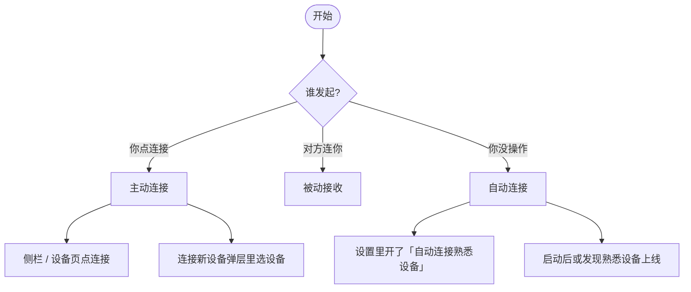
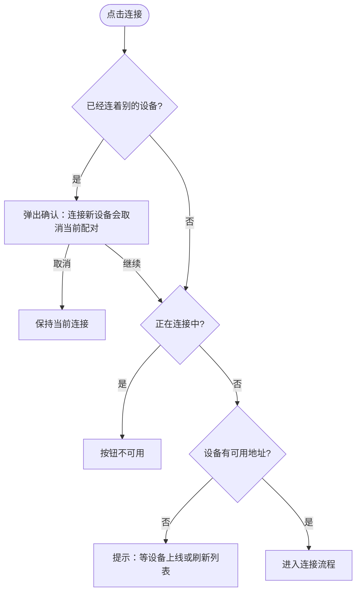
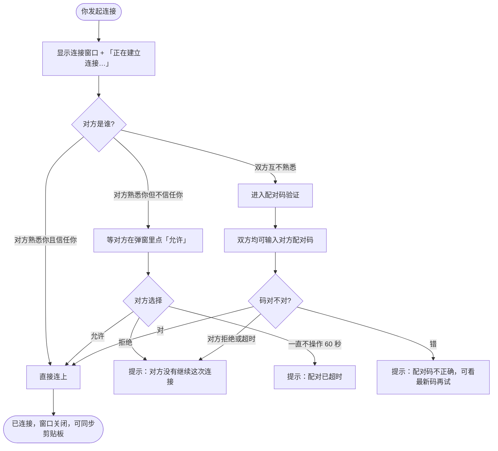
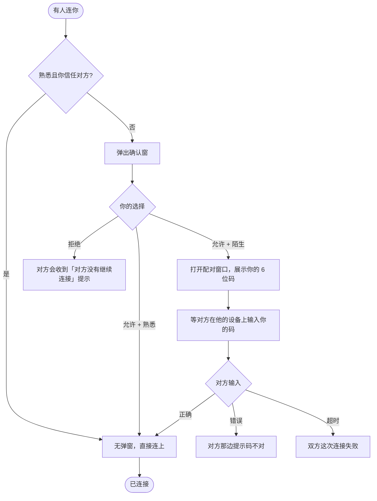
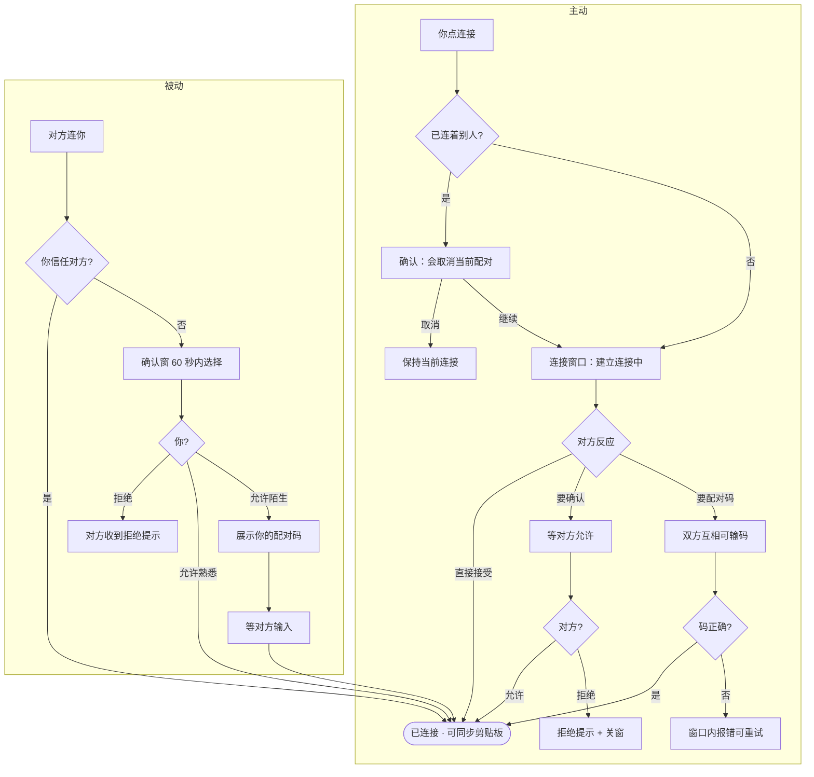

# PlanarClip 连接流程说明（产品视角）

> 描述当前版本中，用户如何发现设备、建立连接、完成配对，以及期间会看到什么、需要做什么。  
> 本文从**使用流程**出发，不涉及实现细节。  
> 完整连接能力仅在**桌面应用**中可用；浏览器预览只能看界面。

---

## 1. 使用前需要知道的事

- 两台设备需在同一局域网，且都打开了 PlanarClip。
- 应用启动后会自动**监听附近设备**和**等待别人连进来**；侧栏显示「监听中」即表示就绪。
- 同一时间只能与**一台**设备保持连接；要换设备，连接新设备时会弹出确认，确认后将断开当前配对并开始新的连接。
- **连接一旦成功**，对方会自动加入你的**熟悉设备**列表，并**默认信任**其来访；只有你主动「移除」，才会变回陌生设备。

---

## 2. 核心概念

产品里有两套彼此独立的维度：**熟悉 / 陌生**（有没有连接记录）与**信任 / 不信任**（对方来找你时要不要自动接受）。设备页的**已配对 / 附近 / 离线**则是按**当前连接与在线状态**分区，与「熟悉」不是同一个意思。

### 2.1 熟悉与陌生（持久关系）

| 关系 | 含义 | 如何变成 / 如何变回 |
|------|------|---------------------|
| **陌生设备** | 从未成功连通过，或你已从熟悉列表移除 | 默认状态；或你主动「移除」之后 |
| **熟悉设备** | 有过至少一次成功连接记录 | **连接一旦成功**即自动归入；除非你主动移除 |

要点：

- **连接成功 → 自动熟悉**：首次连上或重新配对成功后，对方会立刻记入熟悉列表，无需额外操作。
- **移除 → 变回陌生**：点「移除」后从熟悉列表删除；若当时仍连着，会**同时断开**。
- 熟悉关系是**各自维护**的：你这边熟悉对方，不代表对方也一定熟悉你。

### 2.2 信任与不信任（入站自动接受）

| 关系 | 含义 | 你怎么设置 |
|------|------|------------|
| **信任设备** | 对方发起连接时，**自动接受**，不弹确认窗 | 设备名右侧盾牌为实心（默认） |
| **不信任设备** | 对方发起连接时，需你在确认窗里点「允许」 | 设备名右侧盾牌为空心 |

要点：

- **陌生设备第一次连上变熟悉后，自动视为信任**；之后你可随时用盾牌关闭自动接受。
- 盾牌**仅对熟悉设备**有效；陌生设备在配对完成前无法配置。
- 信任只影响**别人连你**；不影响你主动去找别人。

### 2.3 设备页三个分区（连接 / 在线状态）

| 区域 | 什么时候出现 | 说明 |
|------|--------------|------|
| **已配对** | 当前正与这台设备保持着连接 | 只看连接状态；熟悉与陌生均可出现（陌生首次连上后通常已同时归入熟悉列表） |
| **附近** | 同一局域网内**在线且 PlanarClip 正在运行**，但还没连上 | 分「熟悉的」与「陌生的」；熟悉设备排在前面 |
| **离线** | **熟悉设备**，但现在局域网里找不到或 PlanarClip 未在运行 | 陌生设备离线后不会出现 |

**分区规则简述：**

- 已连接 → **已配对**
- 在线未连接 → **附近**（熟悉 / 陌生）；需 mDNS 发现且 PlanarClip 端口可连通
- 熟悉 + 不在线 → **离线**

侧栏也会列出附近发现的设备，可直接点连接。

### 2.4 你看到的三种连接状态

| 状态 | 侧栏显示 | 你能做什么 |
|------|----------|------------|
| 未连接 | 监听中 | 可发起连接、可等别人连进来 |
| 连接中 | 连接中… | 等待对方确认或正在验证配对码 |
| 已连接 | 已连接 | 可同步剪贴板；连接其他设备时会弹出确认并断开当前配对 |

---

## 3. 连接从哪里来

整体上只有三条路：

| 方式 | 谁触发 | 你会不会看到界面 |
|------|--------|------------------|
| **主动连接** | 你点击连接 | 通常会弹出「连接设备」窗口 |
| **被动接收** | 对方连你 | 弹出「是否允许连接」确认窗 |
| **自动连接** | 应用后台 | 对方自动接受时几乎无感；需对方确认时会进入正常等待界面 |

另外还有两个**独立设置**，不要混在一起：

| 设置 | 在哪 | 作用 |
|------|------|------|
| **自动连接熟悉设备** | 设置页 | 你去找已经熟悉的设备连（出站） |
| **信任 / 自动接受** | 设备页，设备名右侧的盾牌图标 | 别人来找你时，是否不问你就直接连上（入站）；仅对熟悉设备有效 |

---

## 4. 主动连接：完整流程

### 4.1 能不能发起？

点连接之前，系统会先判断：

### 4.2 连接过程分几步？

点连接后，会打开**连接设备**窗口，并进入「正在连接」状态。

### 4.3 各阶段你会看到什么

| 阶段 | 窗口里显示 | 你需要做什么 |
|------|------------|--------------|
| 正在连接 | 目标设备信息 + 「正在建立连接…」 | 等待 |
| 等待对方确认 | 同上 | 等对方点允许（熟悉设备场景） |
| 等待输入配对码 | 本机配对码 + 输入框 | 输入对方 6 位数字，或让对方输入你的码 |
| 正在验证 | 「正在验证…」 | 等待 |
| 已连接 | 窗口自动关闭 | 无需操作 |
| 出错 | 窗口内红色提示 | 可关闭后重试 |

### 4.4 主动连接时，你还可以

- **换一台设备**：在连接窗口底部的设备列表里点另一台（会先取消当前这次连接，再连新的）。
- **取消连接**：点窗口关闭按钮或遮罩——若已在等待对方或正在输码，会取消本次连接并回到「监听中」。

---

## 5. 被动接收：别人连你时的流程

### 5.1 你会怎么知道有人要连？

| 情况 | 你怎么感知 |
|------|------------|
| 应用窗口开着 | 弹出确认窗口；任务栏可能闪烁 |
| 窗口关着或最小化 | 系统通知「XX 请求连接」；窗口会在后台出现（不抢焦点） |

即使关过主窗口，后台仍会监听；重新打开窗口后，未处理的连接请求会恢复显示。

### 5.2 收到请求后的第一步：是否允许？

弹出**连接确认**小窗（不是大的配对窗口）：

| 对方是谁 | 标题 | 说明 |
|----------|------|------|
| 熟悉设备 | 收到新的连接请求 | 允许后建立连接（对方已在熟悉列表中，或连上后自动归入） |
| 陌生设备 | 陌生设备请求配对 | 允许后需让对方输入你屏幕上的配对码 |

你必须在 **60 秒内** 点「允许」或「拒绝」，否则这次请求会超时失败。

### 5.3 陌生设备允许配对之后

- 会弹出大的**连接设备**窗口，进入配对码输入环节：展示**你的 6 位配对码**（带 60 秒倒计时），并提供输入框。
- 你可以输入对方的码，也可以让对方输入你屏幕上的码。
- 码快过期时会自动换新，并提示「验证码已更新」。
- 若你此时关闭窗口，等同**拒绝**这次连接。

### 5.4 熟悉设备点「允许」之后

- 确认窗显示「正在连接…」，一般很快完成。
- 不需要配对码。

---

## 6. 自动连接

### 6.1 自动去找熟悉的设备（设置页开关）

**开启后：**

1. 应用启动约 2 秒，会按顺序尝试连接熟悉列表里的设备（优先用局域网里刚发现的，否则用上次记录的地址）。
2. 之后在局域网里**新发现**一台你熟悉的设备上线，也会自动去连。
3. 连上第一条就停止，不会同时连多台。

**前提条件（全部满足才会自动连）：**

- 设置里开关已打开
- 当前没有连着别的设备
- 你没有正在进行的连接或配对
- 对方那边没有拦你（自动接受时可在约 0.4 秒内无感连上）

**对方需手动确认时：** 自动连接在后台发起后，若约 0.4 秒内未能直接连上，会弹出与手动连接相同的「正在等待对方回应」窗口；对方同意后正常完成连接。

**需重新配对时：** 会进入与手动连接相同的配对码输入流程。

**失败时：** 不会有错误弹窗，你仍保持「监听中」，可手动去连。

### 6.2 信任设备的来访（设备名旁的盾牌图标）

**入口：** 设备页各设备卡片上，**设备名称右侧**的盾牌图标（不再使用卡片底部的独立开关行）。

| 图标 | 含义 | 操作 |
|------|------|------|
| 实心盾牌（主题色） | 已信任：对方来访时自动接受 | 点击改为不信任 |
| 空心盾牌（半透明） | 不信任：对方来访时需你确认 | 点击改为信任 |

鼠标悬停可查看当前状态，以及点击后的效果；提示气泡在图标右侧，箭头指向图标。

**适用范围：** 仅**熟悉设备**卡片（已配对、附近 · 熟悉、离线）设备名旁有盾牌，可点击切换。

**默认信任。** 陌生设备首次连上变熟悉后，即视为信任；熟悉设备来访时，若盾牌为实心，则跳过确认窗，直接建立连接。

**改为不信任后：** 每次仍要你在确认窗里点「允许连接」。

这只影响**别人连你**，不影响你去找别人；连接进行中也可以随时切换，只影响**下次**对方来找你时的行为。

---

## 7. 配对码规则

### 7.1 什么时候需要配对码？

- **双方都把对方当陌生人**时，需要 6 位配对码完成验证。
- 熟悉关系是**各自维护**的：若你移除了对方，但对方仍熟悉你，你主动发起连接时，对方那边走**确认允许**流程（不是配对码）；一旦允许，双方即可连接成功。
- 两台都互相熟悉，且相关自动设置都开着，可以**完全不要码**。

### 7.2 配对码怎么输入？

双方进入配对码验证环节后，**都可以输入对方的 6 位配对码**，也可以让对方输入你屏幕上显示的码。  
哪一方先输入正确，即可完成验证。

| 场景 | 典型流程 |
|------|----------|
| 你主动连陌生设备 | 你发起连接 → 对方允许配对 → 双方进入输入环节，互相可输码 |
| 陌生设备来连你 | 你点「允许配对」→ 双方进入输入环节，互相可输码 |

### 7.3 码的有效期

- 每个码大约 **60 秒**有效，过期会自动换新。
- 输入过期或错误的码，会提示重新核对**最新**的 6 位数字。

### 7.4 配对码何时显示？

配对码**只在进入最终输入环节**时显示（等待输入配对码 / 收到配对请求阶段），并带 60 秒倒计时。  
在此之前（选设备、等待对方回应等），连接窗口不会展示本机配对码。

---

## 8. 连接成功之后

- 侧栏变为「已连接」；对方**同时**记入你的**熟悉设备**列表，并**默认信任**其来访。
- 设备出现在设备页 **已配对** 区域（当前正连着）。
- 剪贴板开始在这两台设备间同步文本；熟悉设备名旁出现可点的盾牌，用于配置信任与否。
- 你会看到类似「已与 XX 建立连接，现在可以开始同步剪贴板了」的提示。
- 若是自动重连或恢复，提示可能是「已恢复与 XX 的连接」。
- 断开连接后，该设备从「已配对」区离开，但仍留在熟悉列表里，在「附近」或「离线」中可见（除非你已移除）。

---

## 9. 失败、拒绝与断开

### 9.1 各种结果你会看到什么

| 情况 | 提示大意 | 界面怎样 |
|------|----------|----------|
| **对方拒绝** | 对方没有继续这次连接，请重新发起 | 底部浮层提示（不阻塞操作）；连接窗口关闭 |
| **配对码错误** | 配对码不正确，请查看对方最新验证码 | 连接窗口保留，可改码重试 |
| **超时（60 秒）** | 这次配对已超时，请重新发起 | 连接窗口内错误或需重新连 |
| **连不上（网络等）** | 暂时连不上，请确认对方应用已打开且在同一局域网 | 连接窗口内错误提示 |
| **自己取消** | 已取消本次连接 | 窗口关闭，回到监听 |
| **自己拒绝来访** | 已拒绝这次连接请求 | 确认窗关闭 |
| **对方断开或掉线** | XX 已断开连接，请重新连接 | 回到未连接，可再连 |
| **你点断开** | 已断开当前连接 | 回到未连接 |

### 9.2 拒绝的特殊处理

当你正在等对方确认，或正在输入配对码时，若对方点了拒绝：

- **不会**在连接窗口里留一个错误页让你盯着；
- 会显示一条底部浮层提示（不阻塞操作），然后关掉连接窗口，方便你重新选设备。

### 9.3 断开连接与移除设备

**断开连接：** 在已配对区设备卡片右侧点 **插头图标**（断开），或在侧栏操作。断开后：

- 同步停止；
- 对方仍保留在熟悉设备列表里（除非你在设备页移除）；
- 可再次手动连接，或等自动连接（若已开启）。

**移除设备：** 在熟悉设备卡片上点 **人形带叉图标**（移除）。效果：

- 从熟悉列表删除，设备变回**陌生**；下次连接需重新配对；
- 若移除时正与该设备连着，会**同时断开**；设备从「已配对」消失，出现在「附近 · 陌生」（若仍在线）；
- 操作完成后**不弹出居中提示**，以列表变化为准；仅失败时在剪贴板页状态栏留有说明。

陌生设备卡片上没有移除按钮，也没有盾牌图标。

---

## 10. 设备管理相关操作

### 10.1 设备页顶栏

| 操作 | 入口 | 效果 |
|------|------|------|
| **连接新设备** | 右上角「+」 | 打开连接设备窗口；正在连接中或已达连接上限时不可用 |
| **刷新附近设备** | 「附近」分区标题旁的刷新图标 | 重新扫描局域网，并探测各设备 PlanarClip 是否在运行；离线熟悉设备不会因此上线 |

### 10.2 各分区卡片上的按钮

设备页统一使用**纯图标按钮**（悬停有说明），不同分区组合如下：

| 分区 | 设备名旁 | 卡片右侧（从左到右） | 卡片底部 |
|------|----------|----------------------|----------|
| **已配对** | 盾牌 | 移除 · 断开 | 若有数据：配对于 / 最近活跃、延迟 |
| **附近 · 熟悉** | 盾牌 | 移除 · 连接（闪电图标） | — |
| **附近 · 陌生** | — | 连接（闪电图标） | — |
| **离线** | 盾牌 | 移除 | 最近在线时间 |

图标含义：

| 图标 | 作用 |
|------|------|
| 盾牌 / 空心盾牌 | 切换是否信任该设备来访（见 §6.2） |
| 人形带叉 | 从熟悉列表移除 |
| 闪电 | 发起连接 / 重新连接 |
| 插头 | 断开当前连接（仅已配对区） |

已配对区**不再显示**连接状态圆点；是否连着以所在分区为准。

### 10.3 设置与列表操作对照

| 操作 | 效果 |
|------|------|
| **刷新设备列表** | 同 §10.1 刷新附近设备 |
| **移除设备** | 同 §9.3 移除；熟悉设备卡片上的人形带叉 |
| **将某台改为不信任** | 点设备名旁空心盾牌；仅影响它来找你时是否要确认 |
| **开启「自动连接熟悉设备」** | 设置页开关；仅影响你是否自动去找熟悉的设备 |

---

## 11. 典型场景走查

### 场景 A：两台设备第一次互连

1. A、B 都在同一 Wi-Fi，应用显示「监听中」。
2. A 在设备页「附近 · 陌生」里看到 B，点连接。
3. A 的连接窗口显示「正在向 B 请求连接…」。
4. B 弹出「陌生设备请求配对」，点「允许配对」。
5. B 的连接窗口进入配对码输入环节；A、B 均可输入对方屏幕上的 6 位码并验证。
6. 双方显示已连接，剪贴板可同步；双方同时归入彼此的熟悉列表，并出现在「已配对」区。

### 场景 B：老设备再次见面，双方都熟悉且互相信任

1. A 的设置里开了「自动连接熟悉设备」，B 的设备页里 A 的设备名旁盾牌为实心（已信任）。
2. A 启动应用（或 B 刚上线被发现）。
3. 几秒内自动连上，无弹窗，A 看到「已恢复与 B 的连接」。

### 场景 C：熟悉设备，但 B 不信任 A（关闭了自动接受）

1. A 点连接 B。
2. B 收到确认窗「收到新的连接请求」。
3. B 点「允许连接」→ 连上；点「拒绝」→ A 看到拒绝提示，连接窗关闭。

### 场景 F：移除正在连接中的熟悉设备

1. A 与 B 已连接，B 出现在 A 设备页「已配对」区。
2. A 点 B 卡片上的 **人形带叉** 移除。
3. B 从熟悉列表删除并断开连接；B 出现在「附近 · 陌生」（若仍在线）。
4. 无居中弹窗；若 A 之后想再建立熟悉关系，需重新配对。

### 场景 D：A 在输配对码，B 反悔拒绝

1. A 已在「请输入对方屏幕上的配对码」步骤。
2. B 在确认窗点拒绝。
3. A 弹出「对方没有继续这次连接」，连接窗口关闭，不会卡在错误页。

### 场景 E：窗口关着时有人要连你

1. B 关掉了 PlanarClip 主窗口（托盘仍在）。
2. A 发起连接 B。
3. B 收到系统通知；任务栏图标闪烁；窗口在后台打开并显示确认窗。
4. B 点允许后按熟悉/陌生分支继续。

---

## 12. 流程总图（主动 + 被动）

---

## 13. 当前产品限制

- **实际仍只能维持一条连接**（后端单会话）；连接另一台前会弹出确认，确认后将断开当前配对。界面虽已预留「最多 5 台」的上限提示，在达到上限前仍可切换设备。
- 自动连接失败时不会提示，需手动连接。
- 文本剪贴板同步已稳定；图片、文件已在 Windows 完成主要双机联调（2026-06-29：大图分块、截图粘贴为文件、文件批次、关同步文件名回退）。
- 陌生设备离线后不会出现在列表里，无法从远处发起连接。
- 浏览器里打开的只是界面预览，不能真正连设备。
- 关闭主窗口后，连接和剪贴板同步在后台仍可进行；但界面要重新打开才能操作，未处理的连接请求靠通知提醒。
- 设备页「配对于 …」时间依赖熟悉设备记录；若后端尚未写入配对时间，卡片可能只显示「最近活跃」。

---

## 14. 文档说明

- 本文依据 **2026-06-26** 当前产品行为整理（含「已配对 = 当前连接」「熟悉 / 信任」分维、首次连接默认信任、移除即断连等）。
- 若与你在应用中看到的不一致，以实际界面为准；实现变更后应同步更新本文。
