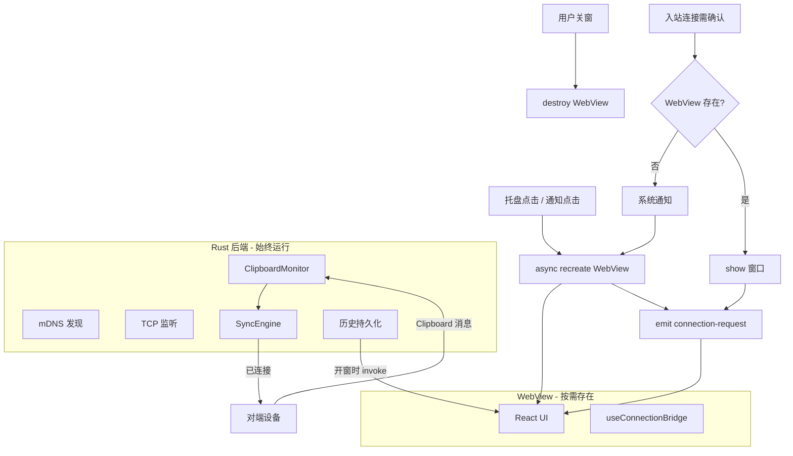

# 关窗销毁 WebView 降低内存占用 — 待执行方案

> 生成时间: 2026-06-26
> 基于讨论: [01-memory-leak-and-current-window-behavior.md](01-memory-leak-and-current-window-behavior.md) | [02-clipboard-after-destroy-and-system-notification.md](02-clipboard-after-destroy-and-system-notification.md)

## 需求概述

PlanarClip 托盘常驻，用户关窗后希望 **释放 WebView 内存**（从 ~300 MB 降至 ~10–20 MB Rust 基线），同时：

1. **剪贴板同步不受影响**：监听本机、发送、接收写入本机剪贴板
2. **连接请求**：需用户确认时，发 **系统通知**，点击后 **重建窗口** 完成连接/配对操作
3. 与已完成的 **事件桥泄漏修复** 一并打包验证

## 技术决策

| 决策项 | 选择 | 理由 | 来源 |
|--------|------|------|------|
| 关窗行为 | `destroy()` 替代 `hide()` | 真正释放 Chromium 进程内存 | 第 1 轮 |
| 开窗行为 | `WebviewWindowBuilder::from_config` 异步重建 | Tauri 2 标准做法；Windows 防死锁 | 第 1 轮 |
| 剪贴板同步 | 保持 Rust 侧不变 | Monitor/SyncEngine/write_clipboard 均独立于 WebView | 第 2 轮 |
| 历史 UI | 开窗时 `get_clipboard_history` 拉取 | 关窗期间 emit 可忽略，数据已持久化 | 第 2 轮 |
| 自动接受连接 | Rust 现有逻辑，无需 UI | `should_auto_accept` 已在后端完成 | 第 2 轮 |
| 需确认连接 | 系统 Toast + 重建窗口 | 用户明确要求；复用 `IncomingConnectionPrompt` | 第 2 轮 |
| 通知实现 | `tauri-plugin-notification` | Tauri 2 官方，Windows Toast | 第 2 轮 |
| 静默启动 | 可选：启动时不创建 WebView | 与 `silent_start` 设置对齐，进一步省内存 | 第 1 轮 |

## 架构设计

## 实现步骤

### Phase 0: 验证泄漏修复（前置）

- [ ] `pnpm build` 生产包
- [ ] 冷启动 ~300 MB，放置 10 分钟不涨到 GB 级

### Phase 1: 窗口生命周期模块（Rust）

- [ ] 新增 `ensure_main_window(app)`：存在则 show，不存在则 `spawn` 异步 `WebviewWindowBuilder::from_config(...).build()`
- [ ] 新增 `destroy_main_window(app)`：`destroy()` 替代 `hide()`
- [ ] 关窗 `CloseRequested`：`prevent_close` → 异步 `destroy_main_window`
- [ ] 托盘左键 / 菜单「打开」：调用 `ensure_main_window`
- [ ] 重建窗口时重新注册 `on_window_event`（CloseRequested → destroy）
- [ ] `silent_start` 启动路径：跳过初始 `show`，且不保留 WebView（可选 Phase 2）

### Phase 2: 系统通知（连接请求）

- [ ] 添加 `tauri-plugin-notification` 依赖与 capability
- [ ] 在 `handle_incoming_connection` 需确认分支：
  - 调用 `ensure_main_window` 或仅发通知（可配置：关窗 destroy 模式下优先通知）
  - 发送 Toast：「{device_name} 请求连接，点击打开确认」
  - 通知点击 → `ensure_main_window`
- [ ] WebView 重建完成后重发 `connection-request`（或 Rust 缓存 pending request 状态供前端查询）
- [ ] 定义 pending 连接超时（建议与现有配对超时对齐，如 60s）

### Phase 3: 前端适配

- [ ] 确认 `useConnectionBridge` 在窗口重建后正常挂载（已在 Phase 0 修复泄漏）
- [ ] 开窗后 `get_clipboard_history` 恢复历史列表（现有逻辑已覆盖）
- [ ] 无需改剪贴板同步逻辑

### Phase 4: 测试与验收

- [ ] 关窗后任务管理器：WebView2 进程消失，内存 ~10–20 MB
- [ ] 关窗状态下：本机复制 → 对端收到；对端复制 → 本机剪贴板更新
- [ ] 关窗状态下：自动接受设备连接成功
- [ ] 关窗状态下：需确认设备 → 收到系统通知 → 点击 → 窗口出现 → 接受/拒绝正常
- [ ] 放置 30 分钟：内存不爬升

## 关键依赖

- Tauri 2 `WebviewWindow::destroy` / `WebviewWindowBuilder::from_config`
- `tauri-plugin-notification`（待添加）
- 已有：`arboard`、`ClipboardMonitor`、`SyncEngine`、direct TCP 连接

## 不在本方案范围

- 剪贴板单条大小上限（可另开主题）
- 前端只存摘要不传全文（可另开主题）
- 通知内直接「接受/拒绝」动作按钮（二期可选）

## 参考讨论

- [第 1 轮：内存与关窗现状](01-memory-leak-and-current-window-behavior.md)
- [第 2 轮：剪贴板与系统通知](02-clipboard-after-destroy-and-system-notification.md)
