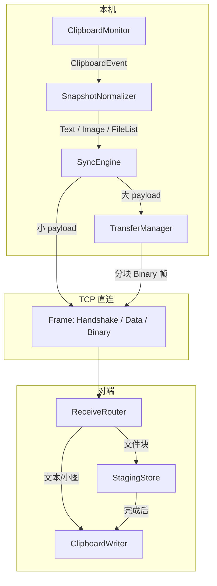

# 第 1 轮：复制图片与文件并传送的方案设计

> 时间: 2026-06-27

## 用户提问

设计一下复制图片与文件并传送的方案

## 背景与分析

### 当前实现边界

PlanarClip 当前仅支持**文本**剪贴板同步，链路如下：

```
ClipboardMonitor (150ms 轮询, arboard::get_text)
    → broadcast::Sender<ClipboardEvent>
    → SyncEngine → ConnectionHandle::send_clipboard
    → DirectConnection TCP 帧 (JSON SignalMessage::Clipboard)
    → 对端接收 → DedupStore 去重 → ClipboardMonitor::write_clipboard
```

关键约束：

| 模块 | 现状 | 对图片/文件的含义 |
|------|------|-------------------|
| `ClipboardSnapshot` | 仅 `Text` / `Empty` | 需扩展 `Image`、`FileList` |
| `SignalMessage` | 仅 `Clipboard { payload: String }` | 需新消息类型 + 二进制帧 |
| `direct.rs` 帧协议 | JSON 最大 16 MB/帧 | 小图可单帧；大文件必须分块 |
| `ClipboardMonitor::read_clipboard` | 只读文本，读失败即报错 | 需按优先级探测多种格式 |
| 设置页 | 「同步图片」「同步文件」为 `planned` | 需落地开关与上限配置 |
| 剪贴板历史 | 仅存文本 `content: String` | 需扩展类型与摘要展示 |
| 去重 | blake3 哈希 | 图片/文件同样适用，但需统一规范化后再哈希 |

传输层已改为**局域网 TCP 直连**（`direct.rs`），不再依赖 WebSocket 信令中继文本，这对大 payload 更友好。

### 与早期方案的衔接

[2026-05-26-cross-platform-clipboard-sync](../2026-05-26-cross-platform-clipboard-sync/execution-plan.md) 中 Phase 2/3 已规划：

- Phase 2：图片（`arboard::get_image`，≤5MB 全量）
- Phase 3：文件列表（Win `CF_HDROP` / Mac `NSPasteboard` URL）+ 分块传输

[第 7 轮](../2026-05-26-cross-platform-clipboard-sync/07-foreseeable-challenges.md) 已识别：

- **文件列表**是 arboard 盲区，需平台原生 API
- **大文件**需自建分块协议（index / total / hash / ack）
- **回环竞态**已有 `SELF_WRITING` + `SUPPRESSED_REMOTE_WRITE` 机制，可复用到图片/文件写入

### 剪贴板语义差异（产品层）

| 用户操作 | 系统剪贴板内容 | 同步语义 |
|----------|----------------|----------|
| 复制图片（截图/浏览器） | 位图或 PNG 数据 | 传像素数据，对端可直接粘贴 |
| 复制文件（资源管理器） | 文件路径引用（非字节） | 需读取源文件并传输，对端还原为「可粘贴的文件」 |
| 复制富文本中的图片 | 可能同时有 HTML + 图片 | MVP 优先独立图片格式；HTML 嵌入图可 Phase 2 后考虑 |
| 复制文件夹 | 多路径列表 | 按多文件批次传输 |

**核心原则**：图片传**内容**，文件传**路径所指向的字节**（并在接收端重建本地路径）。

## 建议与回答

### 1. 总体架构

在现有「监控 → 事件 → 同步引擎 → TCP」链路上，增加**内容类型层**与**传输层**：



**模块职责：**

| 新模块 | 职责 |
|--------|------|
| `clipboard/platform/` | Win/Mac 读文件列表、写文件列表到剪贴板 |
| `clipboard/normalize.rs` | 图片统一转 PNG；文件列表规范化（绝对路径、存在性、大小统计） |
| `sync/transfer.rs` | 分块发送/接收、进度、超时、取消 |
| `storage/staging.rs` | 接收端临时目录 `{app_data}/staging/{transfer_id}/` |

### 2. 数据模型扩展

#### 2.1 ClipboardSnapshot

```rust
pub enum ClipboardSnapshot {
    Text(String),
    Image {
        png_bytes: Vec<u8>,      // 跨平台统一为 PNG
        width: u32,
        height: u32,
    },
    FileList {
        items: Vec<FileClipboardItem>,
    },
    Empty,
}

pub struct FileClipboardItem {
    pub name: String,            // 文件名（不含路径）
    pub size_bytes: u64,
    pub modified_ms: Option<u64>,
    pub content_hash: [u8; 32],  // 整文件 blake3（发送前计算或流式累计）
}
```

**读取优先级**（可配置，默认）：

1. 若启用文件同步且剪贴板含文件列表 → `FileList`
2. 否则若启用图片同步且含图片 → `Image`
3. 否则 → `Text`
4. 皆无 → `Empty`（不发送）

> 避免「复制带图 Word 文档」时误传 HTML 文本而丢图：当检测到图片且无文件列表时，优先图片。

#### 2.2 配置项（`AppConfig`）

```rust
pub sync_images: Option<bool>,           // 默认 true（功能上线后）
pub sync_files: Option<bool>,            // 默认 true
pub max_image_bytes: Option<u64>,        // 默认 5_242_880 (5 MB)
pub max_file_bytes: Option<u64>,         // 默认 104_857_600 (100 MB) 单文件
pub max_file_batch_bytes: Option<u64>,   // 默认 524_288_000 (500 MB) 一次复制多文件总量
pub staging_ttl_hours: Option<u32>,      // 默认 24，过期清理 staging
```

设置页将「暂不支持」改为可编辑开关 + 只读上限说明（上限首期写死，后续可高级设置）。

### 3.  wire 协议设计

#### 3.1 帧类型扩展（`direct.rs`）

现有：

- `0x00` Handshake（JSON）
- `0x01` Data（JSON `SignalMessage`）

新增：

- `0x02` BinaryChunk（原始字节，非 JSON）

```
BinaryChunkHeader (固定 48 字节，大端):
  transfer_id:   [u8; 16]   // UUID
  chunk_index:   u32
  chunk_total:   u32
  payload_len:   u32        // 本块数据长度
  chunk_hash:    [u8; 32]   // 本块 blake3
--- followed by payload_len bytes ---
```

JSON 控制消息负责元数据，Binary 帧负责 payload，避免 base64 膨胀。

#### 3.2 SignalMessage 扩展

```rust
pub enum SignalMessage {
    // 现有
    Clipboard { payload: String, hash: String },
    PeerJoined { peer_id: String },
    PeerLeft { peer_id: String },

    // 新增 — 图片（小图 inline，大图走 transfer）
    ClipboardImageInline {
        hash: String,
        width: u32,
        height: u32,
        mime: String,           // 固定 "image/png"
        data_base64: String,    // 仅当 len <= inline_threshold (512 KB)
    },
    ClipboardImageBegin {
        transfer_id: String,
        hash: String,           // 全图 blake3
        width: u32,
        height: u32,
        total_bytes: u64,
        chunk_size: u32,
    },
    ClipboardImageEnd {
        transfer_id: String,
        hash: String,
    },

    // 新增 — 文件
    ClipboardFileBegin {
        transfer_id: String,
        file_name: String,
        total_bytes: u64,
        content_hash: String,
        chunk_size: u32,
        batch_id: Option<String>,  // 多文件同属一批
        batch_index: Option<u32>,
        batch_total: Option<u32>,
    },
    ClipboardFileEnd {
        transfer_id: String,
        content_hash: String,
    },
    ClipboardFileBatchEnd {
        batch_id: String,
        file_count: u32,
    },

    // 流控
    TransferAck {
        transfer_id: String,
        chunk_index: u32,
    },
    TransferCancel {
        transfer_id: String,
        reason: Option<String>,
    },
}
```

#### 3.3 大小分界策略

| 类型 | 策略 | 阈值 |
|------|------|------|
| 文本 | 现有全量 JSON | 无变更 |
| 图片 | ≤512 KB：`ClipboardImageInline`；否则 Begin → BinaryChunk×N → End | 512 KB / 5 MB 上限 |
| 单文件 | 始终分块（即使很小，统一路径） | 100 MB/文件，500 MB/批 |
| 块大小 | 默认 256 KB | 可配置 |

发送窗口：未收到 `TransferAck` 的在途块 ≤ 8（与早期方案一致）。

### 4. 图片同步详细流程

#### 4.1 发送端

1. `arboard::Clipboard::get_image()` 读取 RGBA
2. 用 `image` crate 编码为 PNG（跨 Win/Mac 粘贴一致）
3. 超过 `max_image_bytes` → **不同步**，记日志 + 可选桌面通知「图片过大，未同步」
4. 计算 blake3 → DedupStore 去重
5. 按阈值选 inline 或分块传输
6. 向所有已连接对端发送（多连接就绪后多播；当前单连接先走现有 handle）

#### 4.2 接收端

1. 校验 hash（inline 直接验；分块在 End 时验全量）
2. DedupStore 去重
3. `SUPPRESSED_REMOTE_WRITE` 注册 hash
4. PNG 解码 → `arboard::set_image()` 写剪贴板
5. 发 `clipboard-history-changed`（摘要：`[图片] 800×600 · 120 KB`）

#### 4.3 平台注意点

- Win 截图常为 DIB/BMP，arboard 可读；统一转 PNG 输出
- Mac 可能为 TIFF，同样转 PNG
- 透明通道保留

### 5. 文件同步详细流程

#### 5.1 读取文件列表（平台特定）

**Windows**（已有 `windows-sys`）：

- `OpenClipboard` → `GetClipboardData(CF_HDROP)` → 解析 `DROPFILES` 结构得路径列表

**macOS**（需新增 `objc2-app-kit` 或 `cocoa`）：

- `NSPasteboard.generalPasteboard` → `readObjectsForClasses:[NSURL class]` → 文件 URL 列表
- 过滤非 `file://` 项

封装为 trait：

```rust
trait PlatformClipboardFiles {
    fn read_file_paths() -> Result<Vec<PathBuf>, ClipboardError>;
    fn write_file_paths(paths: &[PathBuf]) -> Result<(), ClipboardError>;
}
```

#### 5.2 发送端

1. 读取路径列表，过滤不存在/无读权限/超大小文件
2. 若批总量超限 → 拒绝并提示
3. 为每文件生成 `transfer_id`，可选共享 `batch_id`
4. 对每个文件：`FileBegin` → 分块读取（`tokio::fs::File` + 256KB buffer）→ BinaryChunk → `TransferAck` 滑动窗口 → `FileEnd`
5. 多文件全部完成后 `FileBatchEnd`

#### 5.3 接收端

1. 收到 `FileBegin`：在 `staging/{transfer_id}/` 创建临时文件
2. 每块：验 chunk_hash → append → `TransferAck`
3. `FileEnd`：验全文件 hash → 移入 `staging/{batch_id}/{original_name}`（原子 rename）
4. `FileBatchEnd`：将所有路径写入剪贴板（`CF_HDROP` / NSPasteboard URLs）
5. 用户在对端资源管理器/应用中 **Ctrl+V 粘贴文件**

> **不做**自动打开文件或弹保存对话框；行为与用户本地复制文件一致。

#### 5.4 安全与路径

- 只传输**内容**，不传输源路径字符串（避免泄露 `C:\Users\...`）
- 接收端文件名取 `file_name` 字段，冲突时追加 `(1)` 后缀
- staging 目录定期 GC（TTL + 启动时清扫）

### 6. 同步引擎与去重改造

```rust
// SyncEngine / ConnectionHandle
fn send_clipboard_event(&self, event: &ClipboardEvent, settings: &SyncSettings) {
    match &event.snapshot {
        Text(t) => { /* 现有逻辑 */ }
        Image { .. } if settings.sync_images => { /* 新逻辑 */ }
        FileList { .. } if settings.sync_files => { /* 新逻辑 */ }
        _ => {}
    }
}
```

DedupStore：键仍为 blake3 hash；图片/文件在**规范化后**计算 hash，与文本共用 store，窗口大小可维持现有策略。

回环抑制：远程写入图片/文件时，写入前设置相同 hash 的 `SUPPRESSED_REMOTE_WRITE`。

### 7. 前端与 UX

#### 7.1 设置页

- 「同步图片」「同步文件」：`planned` → `editable` 开关
- 描述更新为可操作说明；超限时的用户文案（中文）：
  - 「图片超过 5 MB，未同步到其他设备」
  - 「文件过大，当前最多支持 100 MB」

#### 7.2 剪贴板历史

扩展 `ClipboardHistoryEntry`：

```typescript
{
  id, type: "text" | "image" | "file",
  content: string,        // 文本摘要或 "[图片]" / "report.pdf 等 3 个文件"
  thumbnail_ref?: string, // 图片可选本地缓存路径（仅本机预览）
  file_count?: number,
  size_label: string,
  ...
}
```

`ClipTypeIcon` 已支持三种类型，可直接复用。

#### 7.3 传输进度（Phase B 可选）

- 大文件传输时：`transfer-progress` 事件 → 侧栏或 toast 显示「正在接收 report.zip 42%」
- 发送端同理
- MVP 可先只做 indeterminate「正在同步文件…」

### 8. 实现分期建议

| 阶段 | 范围 | 预估 | 依赖 |
|------|------|------|------|
| **Phase 1** | 图片读取/写入、PNG 规范化、inline 传输、设置开关、历史摘要 | 1–1.5 周 | 无 |
| **Phase 2** | 大图分块、Binary 帧、TransferAck 流控 | 1 周 | Phase 1 |
| **Phase 3** | Win 文件列表读写的发送 + 接收 + staging | 1.5–2 周 | Phase 2 |
| **Phase 4** | macOS 文件列表、批传输、进度 UI | 1–1.5 周 | Phase 3 |
| **Phase 5** | 多连接多播接入、5 台联调 | 0.5 周 | multi-connection 主题 |

**推荐路径**：Phase 1→2 先交付「截图互传」；Phase 3→4 交付「文件互传」。与 multi-connection 可并行开发，但 Phase 5 需等多会话就绪。

### 9. 关键依赖

| 依赖 | 用途 |
|------|------|
| `arboard` 3.x | 图片读写（已有） |
| `image` | RGBA → PNG 编码 |
| `windows-sys` | Win CF_HDROP（已有） |
| `objc2` + `objc2-app-kit` | Mac NSPasteboard 文件 URL |
| `tokio::fs` | 异步分块读文件 |
| `uuid` | transfer_id / batch_id |

### 10. 风险与对策

| 风险 | 等级 | 对策 |
|------|------|------|
| 文件列表 API 跨平台差异 | 中 | trait 隔离；分平台集成测试 |
| 大文件占满内存 | 中 | 流式读写的固定 buffer，禁止整文件读入 |
| 16 MB 帧上限与块大小 | 低 | Binary 帧 header 48B + 256KB payload ≪ 16MB |
| 复制文件时用户期望「秒传」 | 低 | 局域网 256KB×窗口 8 ≈ 2MB/s 起；进度提示 |
| 多连接同时传大文件 | 中 | 全局并发限制：最多 2 个活跃 transfer/设备 |
| 粘贴后路径 staging 被删 | 低 | TTL 24h；写入剪贴板后延长 batch 引用计数 |

### 11. 测试计划（摘要）

1. Win ↔ Win：截图、PNG、JPG 复制粘贴
2. Mac ↔ Mac：同上
3. Win ↔ Mac：交叉平台图片
4. 单文件 1MB / 50MB / 边界 100MB
5. 多文件批（3 个小文件）
6. 超限图片/文件：确认不同步且有中文提示
7. 去重：同一图片连续复制不重复发送
8. 回环：接收后本地 monitor 不再次上传

## 相关图片

- 图 1：设置页中「同步图片」「同步文件」当前为「暂不支持」状态
  

## 本轮要点

- 图片传 **PNG 内容**（arboard + 规范化）；文件传 **路径指向的字节**（平台 API 读列表 + 分块传输 + staging 重建）
- 协议层：**JSON 元数据 + BinaryChunk 二进制帧**，沿用现有 TCP 直连，不引入新传输栈
- 大小策略：小图 inline（≤512KB），大图/文件分块（256KB，窗口 8）
- 读取优先级：文件列表 > 图片 > 文本（均可由设置开关禁用）
- 实现顺序：图片（Phase 1–2）→ 文件（Phase 3–4）→ 多连接多播（Phase 5）
- 设置页与剪贴板历史需同步扩展；用户可见文案全部中文
