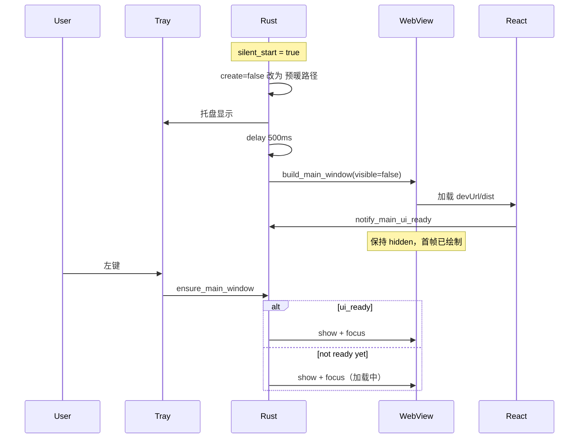

# 静默启动主窗口预暖 — 待执行方案

> ⚠️ **状态: 已放弃**（2026-07-02）。产品改为 **方案 E（冷启动优化）**，见 [00-产品决策.md](00-产品决策.md)。下文仅作历史备查，**勿再按此执行**。

> 生成时间: 2026-07-02  
> 背景: 静默启动后首次点托盘仍有 WebView 冷启动白屏；参考 Sparkle 等应用在隐藏阶段完成首帧渲染。

## 需求概述

在 **保持「静默启动不弹出主窗口」** 的前提下，让 **第一次从托盘打开** 的体感接近「已开好窗」，肉眼尽量不看到白屏 → 内容的过程。

与当前实现的差异：

| 维度 | 当前（master 已提交） | 本方案 |
|------|----------------------|--------|
| 静默启动 | `window.create = false`，无 WebView | 创建 WebView，**始终 `visible: false`** |
| 首次点托盘 | 同步 `build_main_window` + 加载前端 | 仅 `show` + `focus`（若已预暖完成） |
| 关到托盘 | `hide`，保留 WebView | 不变 |
| 内存 | 静默时最低 | 静默时多占一份额 WebView（约 +200～400 MB，视构建而定） |

## 技术决策

| 决策项 | 选择 | 理由 |
|--------|------|------|
| 预暖时机 | 托盘就绪后 **延迟 300～800 ms** 再建隐藏窗 | 先保证托盘与 Rust 后端可用，避免与 mDNS/TCP 抢 CPU |
| 是否 `show` | 预暖全程 **禁止** `show` / `set_focus` | 避免静默启动闪白窗；仅用户主动打开时 show |
| 任务栏 | 预暖窗 `skip_taskbar: true`（若平台支持） | 隐藏窗不应出现在任务栏 |
| 就绪判定 | 前端挂载后 `invoke('notify_main_ui_ready')` | Rust 侧区分「已建窗」与「可展示」 |
| 用户点开过早 | 若未 ready：仍 `show`，可保留现有 UI；或短等（≤300 ms）再 show | 避免点击无反应；优先简单：直接 show，仅优化 ready 后的体验 |
| 配置项 | **v1 不新增开关**，静默启动即预暖 | 减少设置面；若反馈内存敏感再加 `prewarm_main_window` |
| 非静默启动 | 保持现有 `bootstrap_main_window` show | 行为不变 |

## 架构设计

## 实现步骤

### Phase 1：Rust 窗口模块（`Apps/src-tauri/src/window/mod.rs`）

- [ ] 新增应用级状态（可挂在 `AppState` 或 `window` 子模块）：
  - `main_ui_ready: AtomicBool`（默认 false）
  - 可选 `main_prewarm_started: AtomicBool` 防重复预暖
- [ ] 拆分 `build_main_window(app, options)`：
  - `show: bool` — 预暖为 `false`，正常打开为 `true`
  - `steal_focus: bool` — 预暖为 `false`
  - 从 `tauri.conf` 的 `visible: false` 继承；**预暖路径禁止末尾 `window.show()`**
- [ ] 新增 `prewarm_main_window(app: &AppHandle)`：
  - 若已有 `main` 标签 WebView → return
  - 调用 `build_main_window(..., show: false, steal_focus: false)`
- [ ] `present_main_window` / `bootstrap_main_window`：
  - 已有 WebView → `unminimize` + `show` + `focus`（与现逻辑一致）
- [ ] `hide_main_window`：不变

### Phase 2：启动流程（`Apps/src-tauri/src/lib.rs`）

- [ ] **调整 `launch_tray_only` 对 context 的改写**：
  - 不再设 `window.create = false`
  - 改为 `window.create = true`（或依赖 `tauri.conf` 的 `create: false` + 仅走手动 `prewarm`，二选一，推荐 **静默也手动 prewarm**，与现 `create: false` 一致，避免 Tauri 自动 show）
- [ ] `setup` 中当 `startup.silent_start`：
  - **不**调用 `bootstrap_main_window`（不 show）
  - `spawn` 延迟任务：`sleep(500ms)` → `prewarm_main_window(handle)`
- [ ] 注册 Tauri command：`notify_main_ui_ready` → `main_ui_ready.store(true, Ordering::Release)`
- [ ] 窗口 `destroy` 时（若未来再引入）重置 ready；当前 hide 不 destroy，无需重置

### Phase 3：前端就绪信号（`Apps/src/main.tsx` 或 `App.tsx`）

- [ ] 在 `createRoot` 渲染完成且 Tauri 环境下：
  - 使用 `requestAnimationFrame` 双帧或 `useEffect` 空依赖，调用 `invoke('notify_main_ui_ready')`
  - 失败静默（浏览器预览无此 command）
- [ ] **不要**在就绪前调用任何 `getCurrentWindow().show()`

### Phase 4：`tauri.conf.json` 与能力

- [ ] 保持 `visible: false`、`create: false`（由代码统一创建，行为可控）
- [ ] `capabilities/default.json` 为 `notify_main_ui_ready` 增加 invoke 权限（若 code gen 需要）

### Phase 5：入站连接与通知（回归）

- [ ] `present_connection_request`：`had_live_window` 在预暖后为 true → `emit` 路径恢复，与隐藏 WebView 方案一致
- [ ] 确认预暖窗 `skip_taskbar` 时，入站 `ensure_main_window_in_background` 仍能闪任务栏（按需 `set_skip_taskbar(false)` 再 show）

## 风险与缓解

| 风险 | 缓解 |
|------|------|
| 静默时仍闪白窗 | 绝不预暖 `show`；Windows 若仍闪，评估 `opacity: 0` 或 offscreen 坐标（次选） |
| 内存升高 | 文档说明；后续可加设置「静默时不预暖」 |
| 开发模式 `devUrl` 预暖失败（Vite 未起） | `beforeDevCommand` 已起 dev server；预暖延迟可调到 1s；失败打 log，首次点开走现冷启动 |
| 与 `2026-06-26-destroy-webview-on-close` 方案冲突 | 当前产品选择为 **hide 保活**；本方案与 hide 一致，与 destroy 方案互斥 |

## 验收标准

1. **静默启动**：无主窗口弹出、无任务栏主窗口图标（或仅托盘）。
2. **预暖完成后**（约 2～5 s，视机器与 dev/release）首次点托盘：**无明显白屏过渡**，主界面几乎立即呈现。
3. **预暖完成前**点托盘：允许短暂加载，但不得崩溃或无窗。
4. **关窗到托盘再开**：与现行为一致，仍快速。
5. **非静默启动**：启动即打开主界面，行为与改前一致。
6. **剪贴板 / 发现 / 连接**：静默 + 预暖下后端正常；入站需 UI 时能弹出或通知。

## 建议实施顺序

1. Phase 1 + Phase 2（仅 Rust 预暖，无 ready 信号）→ 验证首次 show 是否已比现方案快。  
2. Phase 3 ready 信号 → 微调「极早点击」体验。  
3. Phase 5 全量回归。

## 不在本方案内

- 隐藏时暂停前端轮询（`visibilitychange`）— 可另开性能优化。
- 生产包体积 / 拆 chunk 加速首载 — 与预暖正交。
